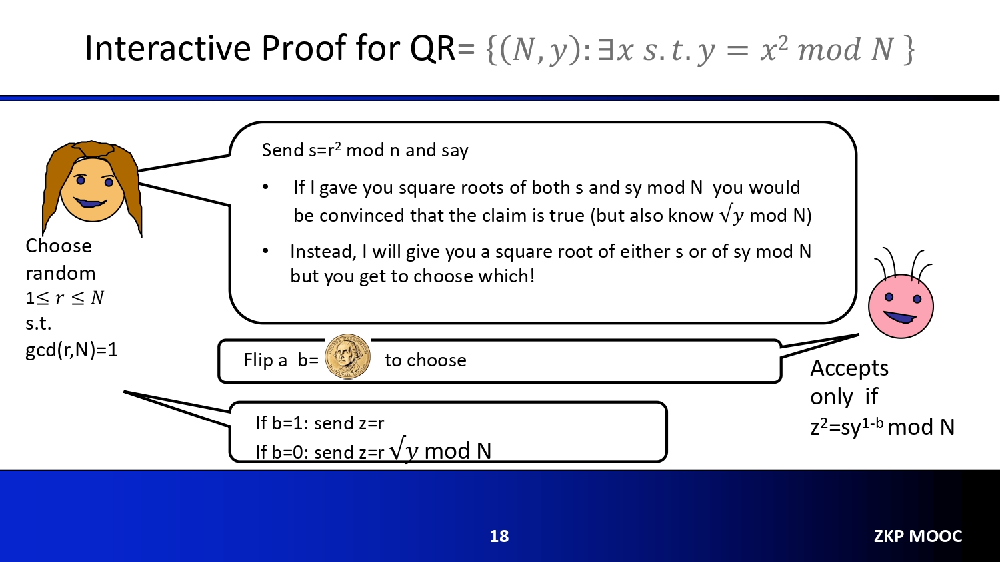
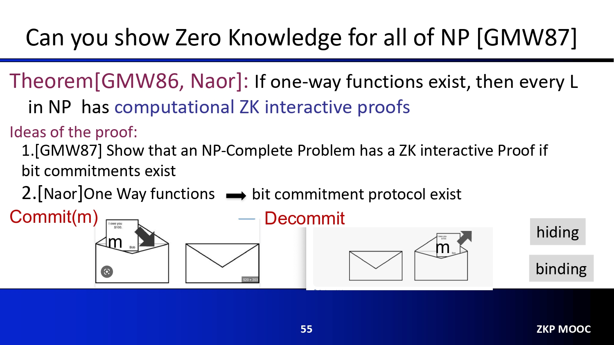
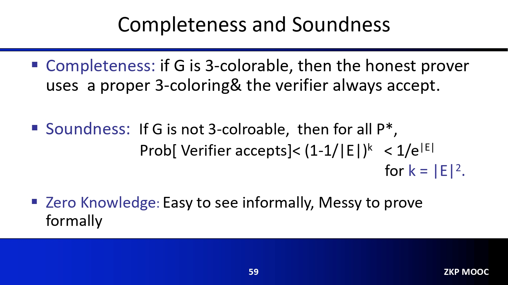

# Notes for Lecture 1
(the notes are below each slide)

## 1 "Send $s=r^2\; mod\; n$ and say" (actually here it should be N, not n)
Things start to get confusing from this line. Actually what it means is: Prover sends a $s$ to verifier, and $s$ satisfies this property: there exists an $r$, s.t. $(s\; mod\; N) == (r^2\; mod\; N)$. For abbreviation, this equation is written as $s = r^2\; mod\; N$. Numbers satisfying this property is called "[quadratic residue modulo N](https://en.wikipedia.org/wiki/Quadratic_residue)".
Therefore, the verifier just gets $s$. He knows $s$ is quadratic residue modulo $N$, but he does not what is the $r$.

## 2 Steps of this IP protocol
The presentation of this protocol in this slide is not very clear (maybe because it is presented with plain text). Here I show a pseudo code version, based on the original ZKP paper[GMP](https://people.csail.mit.edu/silvio/Selected%20Scientific%20Papers/Proof%20Systems/The_Knowledge_Complexity_Of_Interactive_Proof_Systems.pdf)(page 13):
for( i = 0; i < m; i++):
    1. Prover sends a random $s$ to Verifier, and $s$ is quadratic residue modulo $N$. (Note that $s$ is different in each loop iteration)
    2. Verifier remembers $s$, tosses a coin, sends $b$ to Prover: if coin is head up, $b = 1$, otherwise, $b=0$.
    3. Prover sends $z$ to verifier. If $b=1$: send $z=r\; mod\; N$. Note that $mod N$ is missing in the slide. If $b=1$: send $z=r\sqrt{y}\; mod\; N$.
    4. verifier checks if $z^2 = sy^{1-b}\; mod\; N$.

## Why this proof is complete and sound
### Completeness
If $b=1$: send $z=r$. The verifier checks if $z^2 = sy^(1-b)\; mod\; N$. For the Left-hand-side(LHS), because $z=r\; mod\; N$, $z^2 = r^2\; mod\; N$([basic property])(https://en.wikipedia.org/wiki/Modular_arithmetic). For the Right-hand-side(RHS), $sy^(1-b)=s*y^(1-0) = s$. $s = r^2\; mod\; N$ is of course true because that is how $s$ is chosen by the prover. Therefore, $z^2 = r^2\; mod\; N$. Accepts the proof.
If $b=1$: send $z=r\sqrt{y}$. Again the verifier checks if $z^2 = sy^(1-b)\; mod\; N$. For LHS: $z^2 = r^2*y\; mod\; N$. For the Right-hand-side(RHS), $sy^(1-b)=s*y^(1-0) = s*y$. Since $s = r^2 mid N$, according to the [basic property](https://en.wikipedia.org/wiki/Modular_arithmetic) of modular arithmetic, $s*y = r^2*y\; mod\; N$.
Therefore, the Verifier should accept the proof.

### Soundness
To show this proof, we assume Prover is dishonest (he does not know the $x$ for $y$), and then show in any case, the Verifier accepts the dishonest proof is 1/2.
The prover can do bad things in two different ways, since it sends two messages in each round of the protocol:
1. the $s$ is not quadratic residue modulo $N$, but is chosen in this way: choose a random $z$, and $s = z^2*y^{-1}$. So if $b$ happens to be 0, verifier gets this $z$ from prover, and it satisfies $z^2 = s*y^{1-b}$. So verifier accepts it; howeverm if $b$ happens to be 1, since $s$ is not quadratic residue modulo $N$, prover cannot send the correct $r$ to receiver . The accept rate is 1/2.
2. prover chooses a $s$ that is quadratic residue modulo $N$. Then the Verifier can accept the proof when $b=1$. However, when $b=0$, since prover does not know the $x$, he is not able to send the correct $r\sqrt{y}$(unless he is very lucky and guessed the correct). The accept rate is also 1/2.

Therefore, in any case, the accepte rate is 1/2. As more rounds of proof is done, the final accept rate can be exponentially small.
Note that we also show why the two choices ($b=0, 1$) are necessary: if there is always only one choice, the dishonest prover can cheat the verifier.
You can find more detailed information [here](https://crypto.stackexchange.com/questions/9528/zero-knowledge-proof-using-quadratic-residue-why-two-options)

### zero-knowledge
Why the Verifier cannot infer the value of $x$? In each round:
1. If $b=1$, verifier only gets $z = r\; mod\; N$. Of course he knows nothing about $x$.
2. If $b=0$, verifier only gets $z = r\sqrt{y}\; mod\; N = r*x\; mod\; N$. Why the verifier still does not know the $x$? Because the Verifier only knows $s$,
and he know nothing about $r$. Actually $r$ can be many different numbers. Therefore, he knows nothing about $x$. 

## Commit and Decommit
Commit is like encrytion (e.g., can be implemented with a [hash function](https://crypto.stackexchange.com/questions/6790/commitment-scheme-using-hash-functions)). So it should be "hiding": if a value is committed, people cannot guess the original value from the commited value. 
But Decommit is not decryption. Instead, it is the process of checking if the committed value from sender is truly the committed value of the original value. The bottom of Slide 56 gives an example. 

## Soundness
If the prover is dishonest, why the accept probability is smaller than $(1-1/|E|)^k$?
The reason is, if the prover does not know how to 3-color the graph, then in the coloring of the prover, there is at least one edge whose two vertex have the same color.
The verifier randomly selects one edge. The probability that the edge chosen has two same color $>\; 1/|E|$ ($|E| means the number of edges$). 
So the probability that verfier selects an edge with two different colors $(<\; 1-1/|E|)$. 
After $k$ experiments, the probability $<\; (1-1/|E|)^k$. 

## Why we need commit scheme Here
If no commit scheme, the prover can easily cheat: everytime the verifier picks an edge, he just randomly return two colors. However, with the commit scheme, the colors of the graph are fixed after commit (and before verifier selects the edge), and cannot be changed by prover. So the prover cannot cheat.

# TO be finish