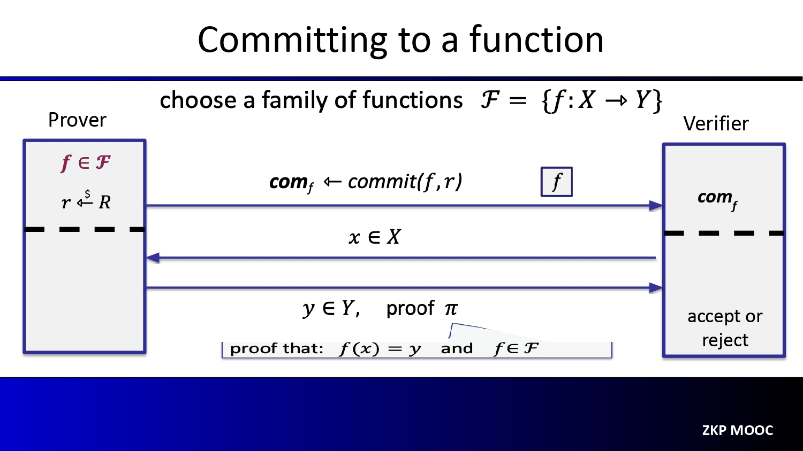
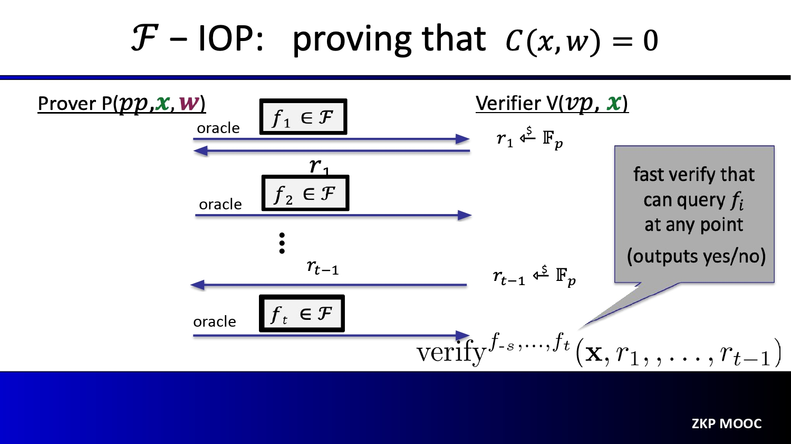

# Notes for Lecture 2
This lecture is only an introduction, so most part are easy to understand or no need to dive into. Things get unclear only in the second half.

## Explanations for this proof process
The prover wants to prove that, he know the function $f$, whose commitment comf is sent to the Verifier. Of course, the easiest way is directly sending the expression of the function to the verifier, and the verifier can check the correctness of sent $f$ by checking if commit(f) == comf.

But the problem is, the function $f$ may be a very long expression. E.g., for a polynomial function, the length of the expression is propotional to the highest degree of the polynomial. comf on the other hand, is a string generated by some function close to hash function. Therefore, comf is much shorter, or has even constant size. Another reason is, the prover may not want the verifier know what the function $f$ is. comf can hind the information of $f$.

Therefore, instead of directly sending $f$ verifier, it works in this way: the verifier sends some random $x$, and prover replies with $y = f(x)$. If the prover can answer the correct $y$ multiple times, then with high probability (W.H.P.), the prover knows the function $f$.

But another question is: how can verifier know the replied $y$ from the prover is correct? Note that verifier does not know the function $f$. This is where the comf comes into play. The comf has one interesting use: even though verifier does not know $f$, he can still use comf to check if $y = f(x)$, with the help of the proof $\pi$ from the prover. 

How does it work? Here I give some slight technical details to help understanding:
within the finite field R in the slide, the function {f: X -> Y} is essentially a group of mappings: for each x in R, maps it to some y. How can we use hash function to commit this mapping? One easy way is, for each mapping pair ($x_i$, $y_i$), do a hashing hi = hash(xi, yi). So if there are N pairs, we can use N hashed values as the commitment of the function. The prover can send "i" as the proof $\pi$, which tells which hashed value (hi) to use. Then the verifier can check if hi = hash(x, y) to know if prover gives the correct answer (x is the random value he sent to prover, y is the reply from prover).

But the approve commitment approach is not good enough: we still need N hashed values, which is too many. The actually commitment reduce the size by hierarchical hashing: h1 and h2 is used to generate a new hash h12 = hash(h1, h2), h3 and h4 is used to generate h34, etc. Then you reduced the total size to half. You can repeat this process again until finally we have only one hash value (comf) as the commitment of the function $f$. This is called [Merkel tree](https://en.wikipedia.org/wiki/Merkle_tree). Then to check the correctness of the (x, y), the verifier needs some intermediate hash values to check if the final hash value is equal to comf. Those intermediate hashed value are the proof $\pi$. [This post](https://www.simplilearn.com/tutorials/blockchain-tutorial/merkle-tree-in-blockchain) is also helpful for understanding how the Merkel tree works for the commitment.

This slide confuses me. I haven't made everything clear. As I have multiple interviews next week, I'll leave it later. :stuck_out_tongue_closed_eyes:
